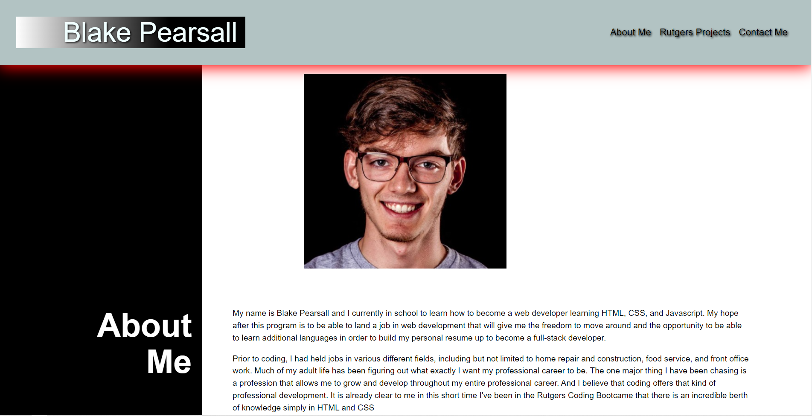
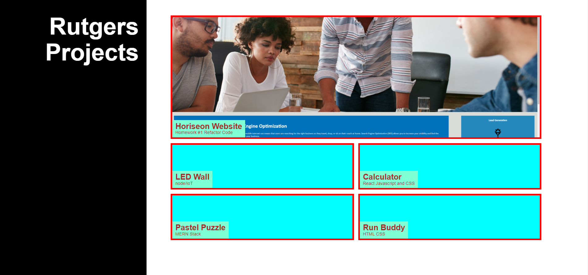
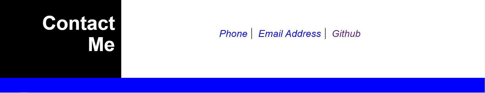

# Read Me

https://bppearsall.github.io/portfolio-Pro/

## Portfolio Homework Assignment

This week we were tasked with designing a portfolio from scratch, utilizing ID's Classes and FlexBoxes.

I have linked the first homework Refactoring of the Horiseon website as my only deployable link in my porftolio. And have made it larger than the rest in order to assign importance to it.

The other links are used as placeholders for futures projects that I will work on, and after completion of those homeworks and personal projects I will slowly add to them and increase the amount of FlexBoxes that are in my portfolio.

I have added a recent photo of me at the top of my portfolio and have included working navigation links at the top of my portfolio that appropriately link to corresponding area on my portfolio.

I have included a contact-me area at the bottom with working links to call my phone, email directly to my email, and a working link to my Github Repositories page.

I have inluded working links to each of my project inside my portfolio. If you click anywhere of the Horiseon link it will take you to the Github page to Horiseon's website.

When you view the webpage on higher and lower resolutions, including making the webpage smaller, the portfolio accurately reacts and moves certain fields around in order to keep a coherent visual experience. 

When the page gets small enough to fit into mobile format, I used media queries to change the overall layout of the page in order to be more condusive to a mobile format. 

I have inlcluded numerous comments in both my HTML and CSS that should make debugging and sharing of my code much easier
